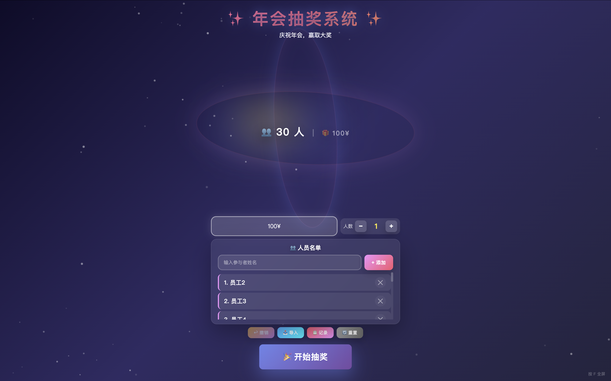

# 🎉 年会抽奖系统 · 纯HTML

> 零依赖、开箱即用的年会抽奖 Web 应用，纯前端，浏览器打开即可使用。




---

## 特性

### 🎰 抽奖引擎
- **单人滚轮抽奖** — 名字滚动带景深透视效果，自然减速停止，箭头指示中奖者
- **多人顺序抽取** — 设置人数后，第一轮手动停止，后续自动连续抽取，每次重新打乱名单保证公平
- **全屏透明中奖名单** — 抽取过程中左侧实时展示所有已中奖人员（固定字号，超出自动滚动）
- **名单自动打乱** — 每次开始抽取前 Fisher-Yates 洗牌，结合随机停止时间，每人概率均等

### 🖥 交互体验
- **全屏粒子背景** — Canvas 动态光点漂浮效果
- **中奖弹窗自动滚动** — 多人中奖时弹窗以片尾字幕风格自动滚动员名单
- **彩带庆祝特效** — 中奖后全屏彩带飘落
- **键盘快捷键** — `F` 全屏，`Esc` 关闭弹窗

### 📦 数据管理
- **localStorage 持久化** — 名单、记录、奖品自动保存，刷新不丢失
- **批量导入** — 支持粘贴名单或上传 `.txt` / `.csv` 文件，自动去重
- **模板下载** — 下载示例格式文件，方便准备数据
- **抽取记录** — 查看 / 导出历史抽奖记录
- **撤销** — 误抽可一键撤销恢复名单
- **重置** — 清空所有数据（含 localStorage）

---

## 快速开始

直接在浏览器打开 `index.html` 即可，**零配置、零依赖**。

```
open index.html
```

### 基本流程

1. 添加参与者（手动或批量导入）
2. 输入本轮奖品名称
3. 设置抽取人数（默认 1）
4. 点击「🎉 开始抽奖」
5. **单人模式**：点击「⏹ 停止」出结果
6. **多人模式**：点击「⏹ 停止」抽出第一人 → 自动连续抽取剩余名额 → 全部完成后弹窗庆祝

---

## 技术栈

| 项目 | 说明 |
|------|------|
| 语言 | 纯 HTML5 + CSS3 + JavaScript (ES6) |
| 依赖 | **零外部依赖** |
| 持久化 | localStorage |
| 动画 | requestAnimationFrame + CSS Animation |
| 兼容性 | Chrome / Firefox / Safari / Edge |

所有代码均在**一个 HTML 文件**中，方便部署和分发（U 盘 / 邮件 / 内网共享）。

---

## 项目结构

```
ai-年会抽奖/
├── index.html    ← 完整应用（含全部样式和脚本）
├── README.md     ← 本文件
└── .gitignore
```
